# Bamazon

Bamazon is command line storefront featuring three distinct user interfaces.

* Bamazon Customer
* Bamazon Manager
* Bamazon Supervisor

As the names imply, each interface targets a different type of user. The customer interface allows users to place orders, the manager interface allows users to view and update inventory, and the supervisor view shows accounting data for the different departments.

## Getting Started

Clone this repository and be sure you have node installed in your environment. Run `npm init` and `npm install` in the local directory.

This application requires the npm inquirer package as well as the npm mysql package.

## Important

For testing purposes, make sure you have mysql installed on your local environment.  This application uses a mysql database running on the localhost.

However, the code will work if your mysql database is running on a remote server.  Just be sure to change the connection parameters in each .js file.

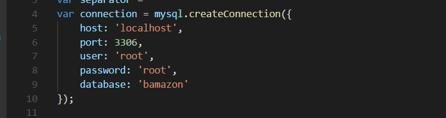

## Demonstrating the Customer Interface

The `bamazonCustomer.js` application provides a user interface for customers to order products from the storefont.

After running `node bamazonCustomer.js`, the user sees a table displaying the current inventory in our store.  This data is stored in a mysql database.

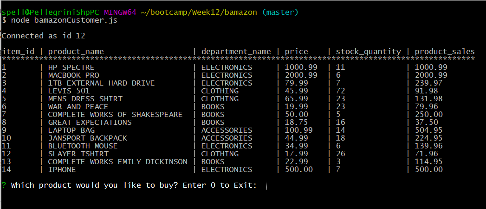

The user then either enters the product number corresponding to the product he or she wants to buy.

If the user enters a product id number that does not exist in the database, they will receive an error message, and will be prompted to enter the product ID again.

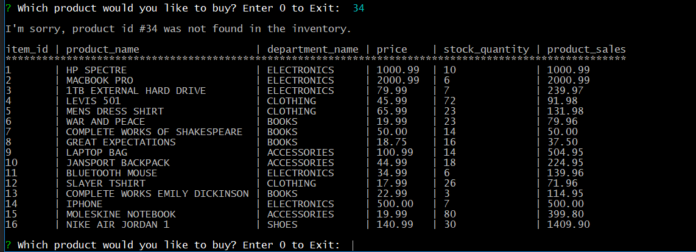

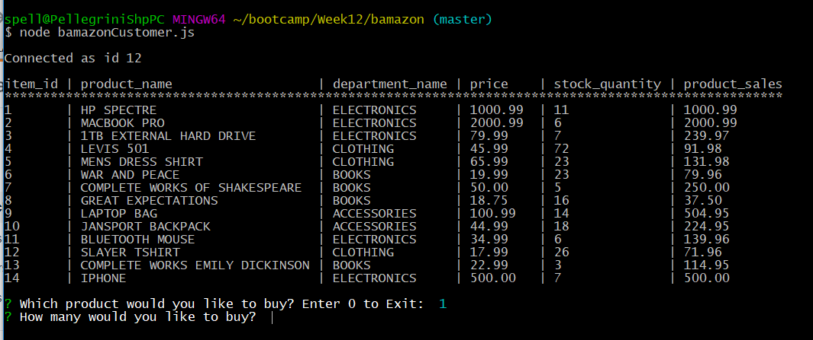

After receiving a quantity, the application calculates and displays the total order cost to the user. This data is added to the `product_sales` column in the products table of our database.  The quanity is also updated.  Finally, the user must choose whether to order additional items or exit the application.

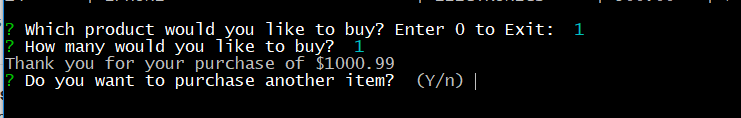

If the user answers yes, the tabe data is again displayed to the user. Note how the `stock_quantity` and `product_sales` columns for the product with `item_id` of 1 are updated.

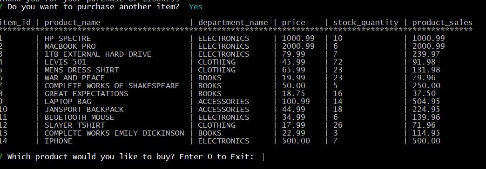

Let's try to order more of a product that we have in stock.  This will demonstrate the application's error checking capabilities.

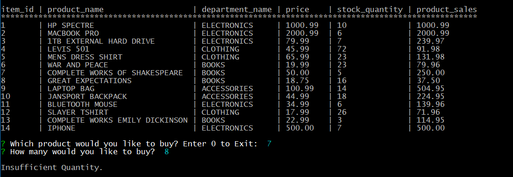

Answering 'no' when asked to make another purchase exits the program.

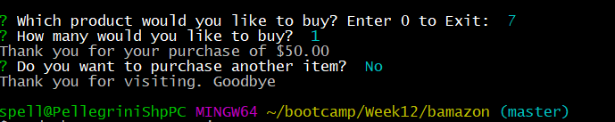

Let's say you ran the program and you don't want to make a purchase, or you accidentally responsed 'yes' when asked to make another purchase. Simply enter 0 when prompted for the product to order, and the program exits.

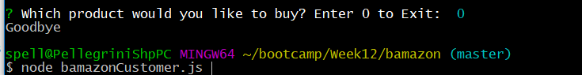

## Demonstrating the Manager Interface

The `bamazonManager.js` application provides various tools for an employee to manage inventory in our store. 

After executing the application, the user is presented with five options.

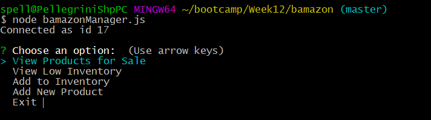

I will now demonstrate each of the options.  

1. The first option, `View Products for Sale`, simply displays the current inventory to the screen. Note how the initial menu is again displayed.

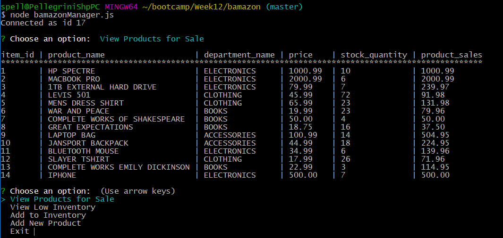

2. The second option, `View Low Inventory`, displays all products with an inventory count lower than 5.

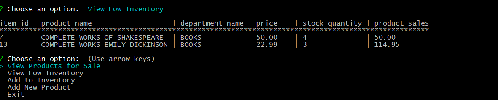

3. Using the third option, `Add to Inventory`, an employee can update an item's inventory quantity.:  
    1. First, they are asked to enter the item number corresponding to to the product they wish to update.

    

    2. Second, the user enters the quantity. The intitial menu is displayed again, and the products table is updated in our database.

    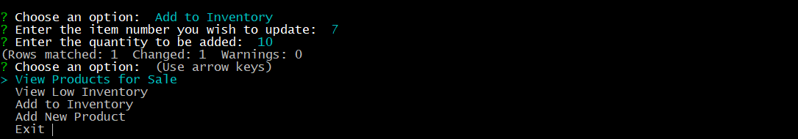

4. The fourth option of the manager intterface, `Add New Product`, is fairly self explanatory.  Using this option, an employee can add a new product to the database:
    1. First the user is prompted to enter the name of the new product. 
        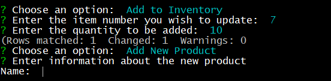
    
    2. After entering the name, the user is asked to enter the department in which the item belongs.
        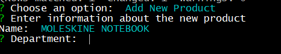

    3. After entering the deparment, the user must enter the item's price.

        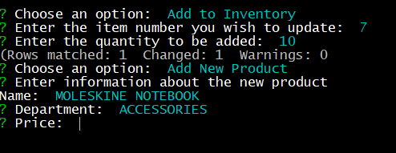

    4. Finally, the user is asked to enter the quantity of the product being added to the inventory.

        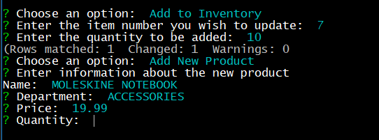

    5. Entering a quantity returns the success (or failure) of the query, and returns the user to the intitial menu.

        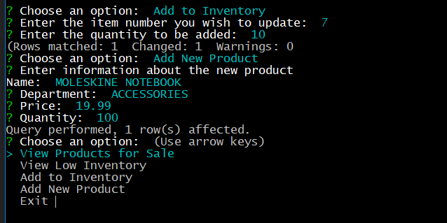

    6. To verify, we can disply the product inventory again, and we will see our new item
        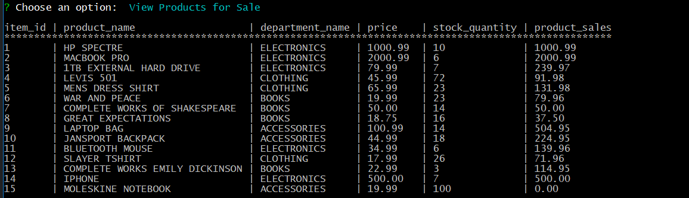

5. The final option in the manager interface, `Exit`, quits the program.
    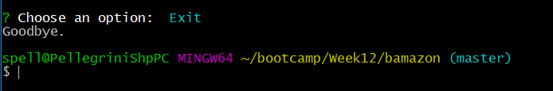

## Demonstrating the Supervisor Interface

Running the `bamazonSupervisor.js` file launches the supervisor command line tool, which allows an employee to `View Sales by Department` or to `Create New Department`.

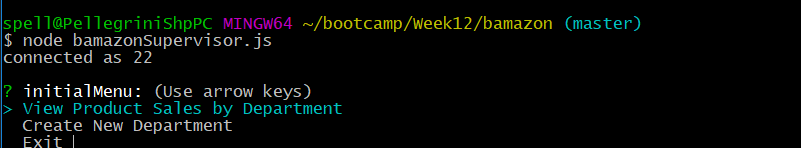

Let's look at each of the options.

1. `View Product Sales by Department`

This option queries the bamazon database and outputs sales statistcs for each department.

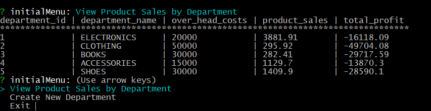

2. `Create New Department`

This option walkes the user through a series of prompts to create a new department in the store.

First, the user must enter the department name.

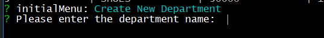

Next, the user enters the overhead cost for the department.

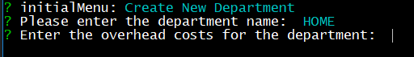

After entering a value for overhead costs, the console logs the success (or failure) of the query, and the user 
returns to the initial prompt.

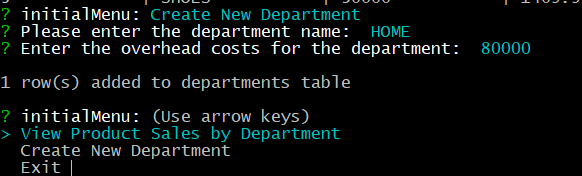